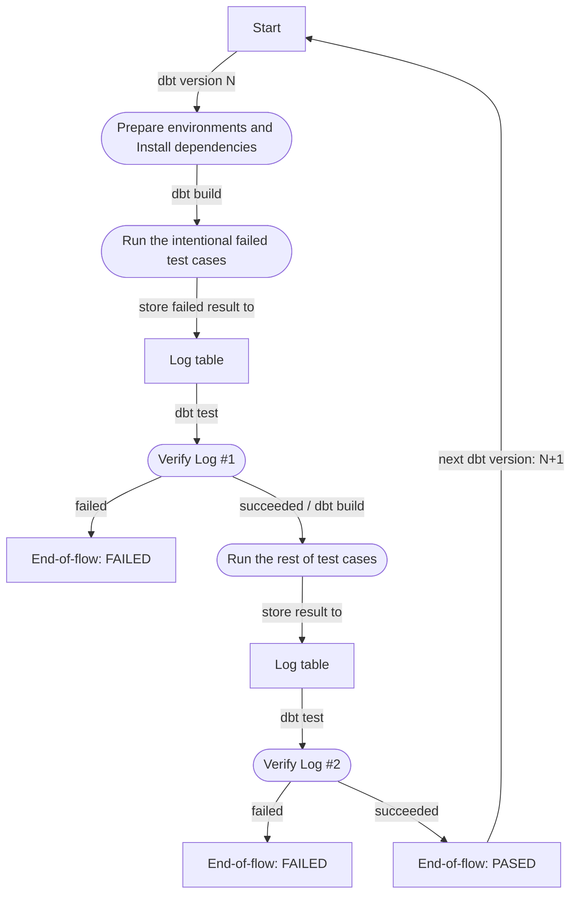

# Contributing to `dq-tools`

`dq-tools` is open source software, whether you are a seasoned open source contributor or a first-time committer, we welcome and encourage you to contribute code, documentation, ideas, or problem statements to this project.

Remember: all PRs (apart from cosmetic fixes like typos) should be [associated with an issue](https://docs.getdbt.com/docs/contributing/oss-expectations#pull-requests).

1. [About this document](#about-this-document)
1. [Getting the code](#getting-the-code)
1. [Setting up an environment](#setting-up-an-environment)
1. [Implementation guidelines](#implementation-guidelines)
1. [Testing dq-tools](#testing)
1. [Submitting a Pull Request](#submitting-a-pull-request)

## About this document

There are many ways to contribute to the ongoing development of `dq-tools`, such as by participating in discussions and issues. We encourage you to first read our higher-level document: ["Expectations for Open Source Contributors"](https://docs.getdbt.com/docs/contributing/oss-expectations).

The rest of this document serves as a more granular guide for contributing code changes to `dq-tools` (this repository). It is not intended as a guide for using `dq-tools`, and some pieces assume a level of familiarity with Python development (virtualenvs, `pip`, etc). Specific code snippets in this guide assume you are using macOS or Linux and are comfortable with the command line.

### Notes

- **Branches:** All pull requests from community contributors should target the `main` branch (default). If the change is needed as a patch for a version of `dq-tools` that has already been released (or is already a release candidate), a maintainer will backport the changes in your PR to the relevant branch.

## Getting the code

### Installing git

You will need `git` in order to download and modify the `dq-tools` source code. On macOS, the best way to download git is to just install [Xcode](https://developer.apple.com/support/xcode/).

### External contributors

You can contribute to `dq-tools` by forking the `dq-tools` repository. For a detailed overview on forking, check out the [GitHub docs on forking](https://help.github.com/en/articles/fork-a-repo). In short, you will need to:

1. Fork the `dq-tools` repository
2. Clone your fork locally
3. Check out a new branch for your proposed changes
4. Push changes to your fork
5. Open a pull request against `infinitelambda/dq-tools` from your forked repository

## Setting up an environment

There are some tools that will be helpful to you in developing locally. While this is the list relevant for `dq-tools` development, many of these tools are used commonly across open-source python projects.

### Tools

These are the tools used in `dq-tools` development and testing:
- [`poetry`](https://python-poetry.org/docs/) to setup the local development environment
- [Github Action](https://circleci.com/) for automating tests and checks, once a PR is pushed to the `dq-tools` repository

### Developer's Guide
- Quick Start (if you already setup the local dev):
    ```bash
    cd /path/to/dq-tools/integration_tests
    python3 -m poetry shell
    ```

- Prequisites:
    - Install Python 3.9.6+ as recommended (specified in [pyproject.toml](./../pyproject.toml))
        > Assuming your python alias: `python3`

        > Don't need to use alias if your enviroment is not multi python version

    - Install `poetry`
    ```bash
    python3 -m pip install poetry
    ```

- Setup dev local enviroment
    1. Set working dir
    ```bash
    cd /path/to/dq-tools
    ```
    2. Install dependencies
    ```bash
    python3 -m poetry install
    ```
    3. Start shell (equivalent to activate virtualenv)
    ```bash
    python3 -m poetry shell
    ```
    4. Install dev dependencies
    ```bash
    poe git-hooks
    # Yes, it's poe, it's not a spelling mistake :)
    ```

    Now, you can play with dbt as further!
    - Verify dbt installed version
        ```bash
        dbt --version
        ```
    - Copy [profiles](./ci/sample.profiles.yml) to '.dbt' dir (create if not exists) under the Users dir.
        ```bash
        # Linux/MacOs
        mkdir ~/.dbt > /dev/null 2>&1
        cp ./profiles/profiles.yml ~/.dbt/profiles.yml
        ```
        NOTE: To simplify the dev, here we update the real `password` value (not using `env_vars`) in the profiles.yml after copying

    - Check dbt configs:
        ```bash
        cd integration_tests
        dbt debug [--profiles-dir /path/to/profiles-dir]
        ```
    - Run your model
        ```bash
        dbt deps
        dbt seed
        dbt run [--select your_model]
        dbt run --target test -s 02_raw 03_presentation
        ```

    To exit the shell:
    ```bash
    exit
    # Enter
    ```

A deep understanding of these tools in not required to effectively contribute to `dq-tools`, but we recommend checking out the attached documentation if you're interested in learning more about each one.

## Implementation guidelines

Ensure that changes will work on "non-core" adapters by:
- dispatching any new macro(s) so non-core adapters can also use them
- using [`type_*` macros](https://docs.getdbt.com/reference/dbt-jinja-functions/cross-database-macros#data-type-functions) instead of explicit datatypes (e.g. [`type_timestamp()`](https://docs.getdbt.com/reference/dbt-jinja-functions/cross-database-macros#type_timestamp) instead of `TIMESTAMP`

## Testing

Once you're able to manually test that your code change is working as expected, it's important to run existing automated tests, as well as adding some new ones. These tests will ensure that:
- Your code changes do not unexpectedly break other established functionality
- Your code changes can handle all known edge cases
- The functionality you're adding will _keep_ working in the future

See here for details for running existing integration tests and adding new ones:

**An integration test typically involves making 1) a new seed file 2) a new model file 3) a generic test to assert anticipated behaviour.**

For an example integration tests, check out the tests for the `not_null_where_db` test macro:

1. [Macro definition](https://github.com/infinitelambda/dq-tools/blob/main/macros/generic_tests/test_not_null_where_db.sql)
2. [Seed or Model file with fake data](https://github.com/infinitelambda/dq-tools/blob/main/integration_tests/seeds/generic_tests/data_test_not_null.csv)
3. [A generic test to assert the macro works as expected](https://github.com/infinitelambda/dq-tools/blob/main/integration_tests/models/generic_tests/data_test_not_null.yml)

Once you've added all of these files, you should be able to run:

Assuming you are in the `integration_tests` folder,
```bash
dbt deps --target {your_target} [--vars '{dbt_test_results_to_db: true}']
dbt seed --target {your_target} [--vars '{dbt_test_results_to_db: true}']
dbt run --target {your_target} --model {your_model_name} [--vars '{dbt_test_results_to_db: true}']
dbt test --target {your_target} --model {your_model_name} [--vars '{dbt_test_results_to_db: true}']
```

Alternatively, at the root repo folder (`/dq_tools`):
```bash
chmod +x run_test.sh
./run_test.sh {your_target} {your_models}
```
...make sure you set the dbt profile environment variables:
```bash
export DBT_SNOWFLAKE_TEST_ACCOUNT=your_value
export DBT_SNOWFLAKE_TEST_USER=your_value
export DBT_ENV_SECRET_SNOWFLAKE_TEST_PASSWORD=your_value
export DBT_SNOWFLAKE_TEST_ROLE=your_value
export DBT_SNOWFLAKE_TEST_DATABASE=your_value
export DBT_SNOWFLAKE_TEST_WAREHOUSE=your_value
```
where ... is replaced with your sensitive data. make sure to be careful of whitespaces!

If the tests all pass, then you're good to go! All tests will be run automatically when you create a PR against this repo.


### CI flow
We're amining to perform the testing against the last n versions of dbt.

For a pair of 1 dbt version and 1 data warehouse, we would have the flow as below:



## Submitting a Pull Request

A `dq-tools` maintainer will review your PR. They may suggest code revision for style or clarity, or request that you add unit or integration test(s). These are good things! We believe that, with a little bit of help, anyone can contribute high-quality code.

Automated tests run via CircleCI. If you're a first-time contributor, all tests (including code checks and unit tests) will require a maintainer to approve. Changes in the `dq-tools` repository trigger integration tests.

Once all tests are passing and your PR has been approved, a `dq-tools` maintainer will merge your changes into the active development branch. And that's it! Happy developing :tada: