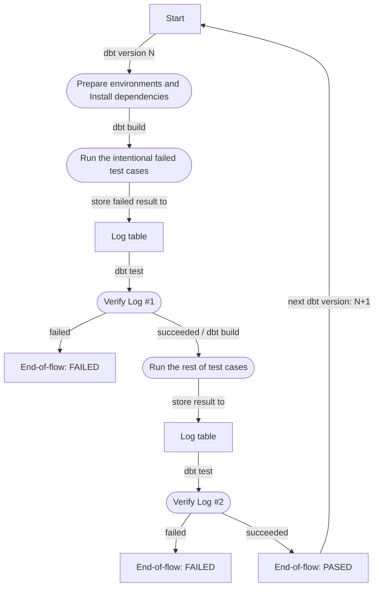

# Integration Tests - Data Quality Tool
This is the test suite of `dq_tools` package

## Add your integration test
This directory contains a child dbt project which tests the macros and the test functions in the dq-tools package. An integration test typically involves making 1) a new seed file 2) a new model file 3) a generic test to assert anticipated behaviour.

For an example integration tests, check out the tests for the `not_null_where_db` test macro:

1. [Macro definition](./../macros/generic_tests/test_not_null_where_db.sql)
2. [Seed or Model file with fake data](./seeds/generic_tests/data_test_not_null.csv)
3. [A generic test to assert the macro works as expected](./models/generic_tests/data_test_not_null.yml)

Once you've added all of these files, you should be able to run:

Assuming you are in the `integration_tests` folder,
```bash
dbt deps --target {your_target} [--vars '{dbt_test_results_to_db: true}']
dbt seed --target {your_target} [--vars '{dbt_test_results_to_db: true}']
dbt run --target {your_target} --model {your_model_name} [--vars '{dbt_test_results_to_db: true}']
dbt test --target {your_target} --model {your_model_name} [--vars '{dbt_test_results_to_db: true}']
```

Alternatively, at the root repo folder (`/dq_tools`):
```bash
chmod +x run_test.sh
./run_test.sh {your_target} {your_models}
```
...make sure you set the dbt profile environment variables:
```bash
export DBT_SNOWFLAKE_TEST_ACCOUNT=your_value
export DBT_SNOWFLAKE_TEST_USER=your_value
export DBT_ENV_SECRET_SNOWFLAKE_TEST_PASSWORD=your_value
export DBT_SNOWFLAKE_TEST_ROLE=your_value
export DBT_SNOWFLAKE_TEST_DATABASE=your_value
export DBT_SNOWFLAKE_TEST_WAREHOUSE=your_value
```
where ... is replaced with your sensitive data. make sure to be careful of whitespaces!

If the tests all pass, then you're good to go! All tests will be run automatically when you create a PR against this repo.


### CI flow
We're amining to perform the testing against the last n versions of dbt.

For a pair of 1 dbt version and 1 data warehouse, we would have the flow as below:



## Developer's Guide
- Quick Start (if you already setup the local dev):
    ```bash
    cd /path/to/dq-tools/integration_tests
    python3 -m poetry shell
    ```

- Prequisites:
    - Install Python 3.9.6+ as recommended (specified in [pyproject.toml](./../pyproject.toml))
        > Assuming your python alias: `python3`

        > Don't need to use alias if your enviroment is not multi python version

    - Install `poetry`
    ```bash
    python3 -m pip install poetry
    ```

- Setup dev local enviroment
    1. Set working dir
    ```bash
    cd /path/to/dq-tools
    ```
    2. Install dependencies
    ```bash
    python3 -m poetry install
    ```
    3. Start shell (equivalent to activate virtualenv)
    ```bash
    python3 -m poetry shell
    ```
    4. Install dev dependencies
    ```bash
    poe git-hooks
    # Yes, it's poe, it's not a spelling mistake :)
    ```

    Now, you can play with dbt as further!
    - Verify dbt installed version
        ```bash
        dbt --version
        ```
    - Copy [profiles](./ci/sample.profiles.yml) to '.dbt' dir (create if not exists) under the Users dir.
        ```bash
        # Linux/MacOs
        mkdir ~/.dbt > /dev/null 2>&1
        cp ./profiles/profiles.yml ~/.dbt/profiles.yml
        ```
        NOTE: To simplify the dev, here we update the real `password` value (not using `env_vars`) in the profiles.yml after copying

    - Check dbt configs:
        ```bash
        cd integration_tests
        dbt debug [--profiles-dir /path/to/profiles-dir]
        ```
    - Run your model
        ```bash
        dbt deps
        dbt seed
        dbt run [--select your_model]
        dbt run --target test -s 02_raw 03_presentation
        ```

    To exit the shell:
    ```bash
    exit
    # Enter
    ```